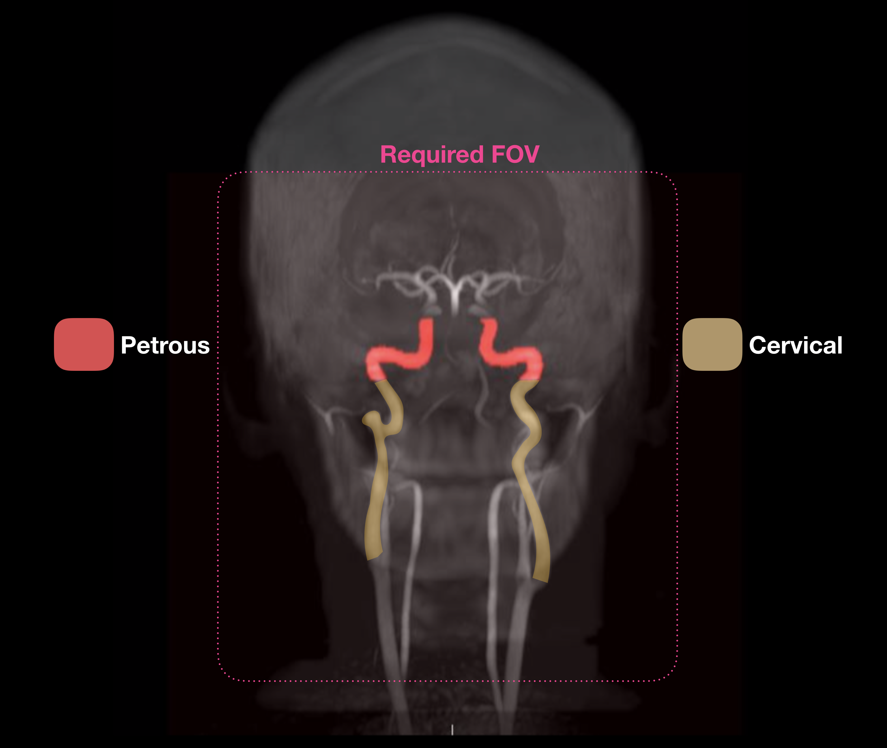

# AQuaPi Toolbox

AQuaPi: Absolute Quantification Pipeline, is a MATLAB based computational toolbox, for non-invasively measuring cerebral metabolic rates of glucose using the synergistic data from a fully-integrated PET/MR.The framework comprises of an image-derived input function component and a quantification component, that work together to produce cerebral metabolic rates of glucose maps.

Table of Contents
=================

  * [Abilities](#Abilities)
  * [Requirements](#Requirements)
     * [Ideal PET/MR protocol](#Ideal-PETMR-protocol)
  * [Literature](#Literature)
  * [Installation](#Installation)
  * [Usage](#Usage)
    * [Automated petrous/cervical segmentation](#Automated-petrouscervical-segmentation)
    * [MR-driven motion compensation](#MR-driven-motion-compensation)
    * [Iterative regional partial volume correction](#terative-regional-partial-volume-correction)
    * [Voxel-wise Patlak analysis](#Voxel-wise-Patlak-analysis)
    * [Spatial normalisation](#Spatial-normalisation)
    * [Z-Score calculation](#Z-Score-calculation)
  * [Contributing](#Contributing)
  * [Funding](#Funding) 
  * [Credits](#Credits)
  * [License](#License)
  

# Abilities

- Petrous/cervical segmentation from a 3D time-of-flight MR angiography dataset
- MR driven motion compensation (motion navigators needed): alignment of attenuation maps possible.
- Iterative regional partial volume correction aware of the activity variations of the target and background.
- Voxelwise Patlak analysis
- Spatial normalisation (SPM12 DARTEL)
- Z-score calculation

# Requirements

- Software requirements
  - MATLAB version > or = R2016a 
  - SPM 12 
  - Siemens e7 reconstruction tools + JS-recon
  - Powershell ISE > 4.0
- Input data: Refer to the individual pages for detailed requirements.
  - 3D time-of-flight MR angiography
  - 60-min PET list-mode acquisition
  - 3D MPRAGE T1 MR sequence
  - 3D EPI MR navigators
  - Attenuation map: preferrably CT or pseudo-CT

## Ideal PET/MR protocol 

# Literature

- Shiyam Sundar LK, Muzik O, Beyer T. (2018). Towards quantitative [18F]FDG-PET/MRI of the brain: Automated MR-driven calculation of an image-derived input function for the non-invasive determination of cerebral glucose metabolic rates. Journal of Cerebral Blood Flow & Metabolism. https://doi.org/10.1177/0271678X18776820
- Shiyam Sundar LK, Muzik O, Beyer T. (2019). The promise of fully-integrated PET/MR imaging: Non-invasive clinical quantification of cerebral glucose metabolism. The Journal of Nuclear Medicine. https://doi.org/10.2967/jnumed.119.229567

# Installation

# Usage

  ### Automated petrous/cervical segmentation
  #### Overview
  The segmentation algorithm has the ability to segment both the petrous and cervical region of the internal carotid arteries from the 3D time-of-flight MR angiography images in one go. 
  #### Hard-requirements
  - The field-of-view should include both petrous and cervical portion of the internal carotid arteries (refer the field-of-view shown below). 
  - Patient position should be head first supine (HFS orientation)
  #### Recommended field-of-view
  
  #### Tips
  1. Acquisition plane must be perpendicular to the blood flow in the internal carotid arteries. This ensures maximum contrast between the blood vessels and the surrounding tissues.
  2. The imaging field-of-view should be larger than the imaging object. This would prevent wrap-around artifacts like the nose protruding through the back of the head.
  #### The code breaks
  1. When there is a significant Signal drop in the blood vessels.
  2. When there are severe wrap-around artifacts.
  #### Running the codes 
  
  ### MR-driven motion compensation
  ### Iterative regional partial volume correction
  ### Voxel-wise Patlak analysis
  ### Spatial normalisation
  ### Z-score calculation

# Contributing

# Funding

This work was supported by the Austrian Science Fund KLI482-B31. We would like to thank Nvidia Corporation for graciously supporting us with the Nvidia Titan Xp GPU for accelerating our workflow.

# Credits

People responsible for awesome images:

- Benedikt Schmiedinger Dipl. Radiologietechnologe
- Julia Kesselbacher BSC Radiologietechnolgin

# License

MIT License

Copyright (c) 2019 Lalith Kumar Shiyam Sundar, Quantitative Imaging and Medical Physics, Medical University of Vienna

Permission is hereby granted, free of charge, to any person obtaining a copy
of this software and associated documentation files (the "Software"), to deal
in the Software without restriction, including without limitation the rights
to use, copy, modify, merge, publish, distribute, sublicense, and/or sell
copies of the Software, and to permit persons to whom the Software is
furnished to do so, subject to the following conditions:

The above copyright notice and this permission notice shall be included in all
copies or substantial portions of the Software.

THE SOFTWARE IS PROVIDED "AS IS", WITHOUT WARRANTY OF ANY KIND, EXPRESS OR
IMPLIED, INCLUDING BUT NOT LIMITED TO THE WARRANTIES OF MERCHANTABILITY,
FITNESS FOR A PARTICULAR PURPOSE AND NONINFRINGEMENT. IN NO EVENT SHALL THE
AUTHORS OR COPYRIGHT HOLDERS BE LIABLE FOR ANY CLAIM, DAMAGES OR OTHER
LIABILITY, WHETHER IN AN ACTION OF CONTRACT, TORT OR OTHERWISE, ARISING FROM,
OUT OF OR IN CONNECTION WITH THE SOFTWARE OR THE USE OR OTHER DEALINGS IN THE
SOFTWARE.

