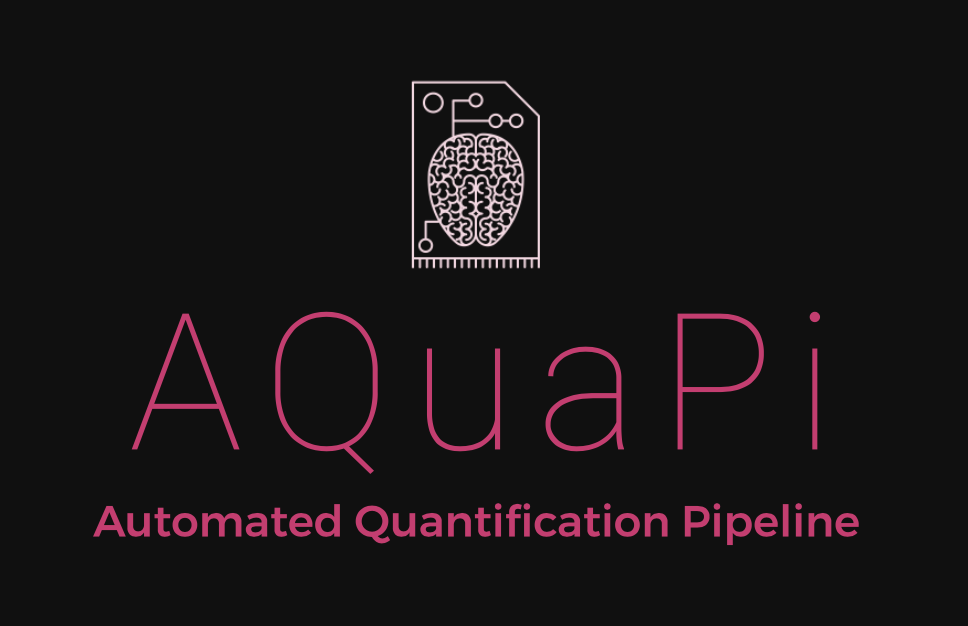
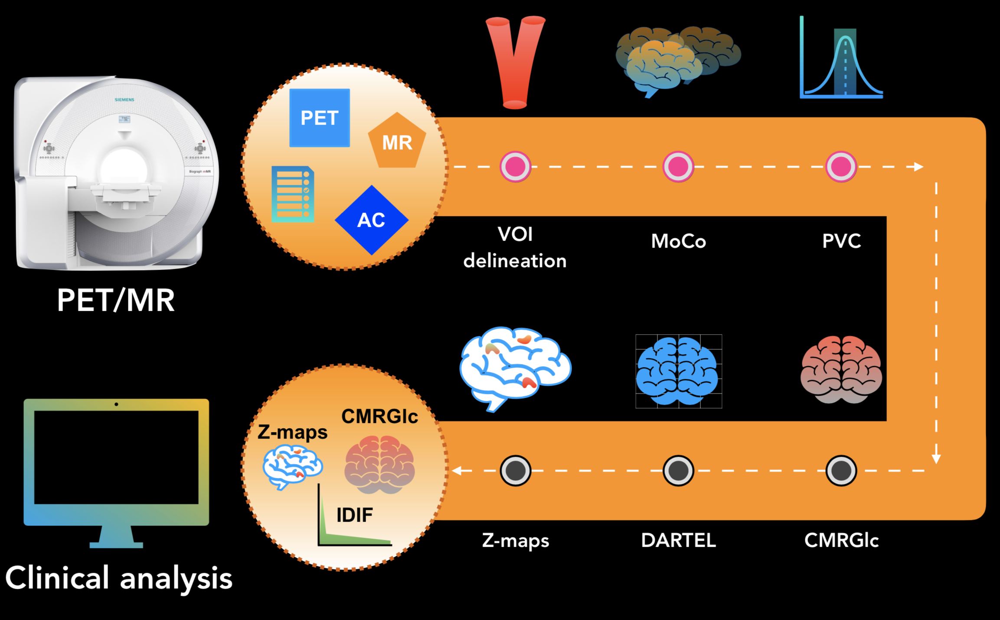
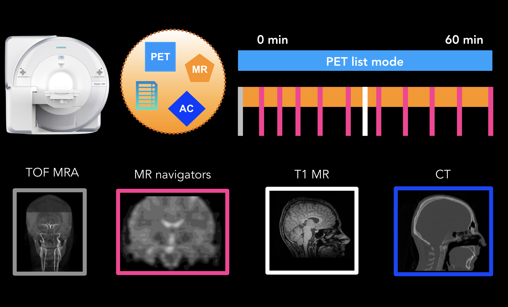
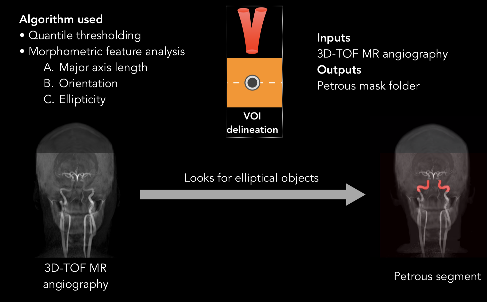
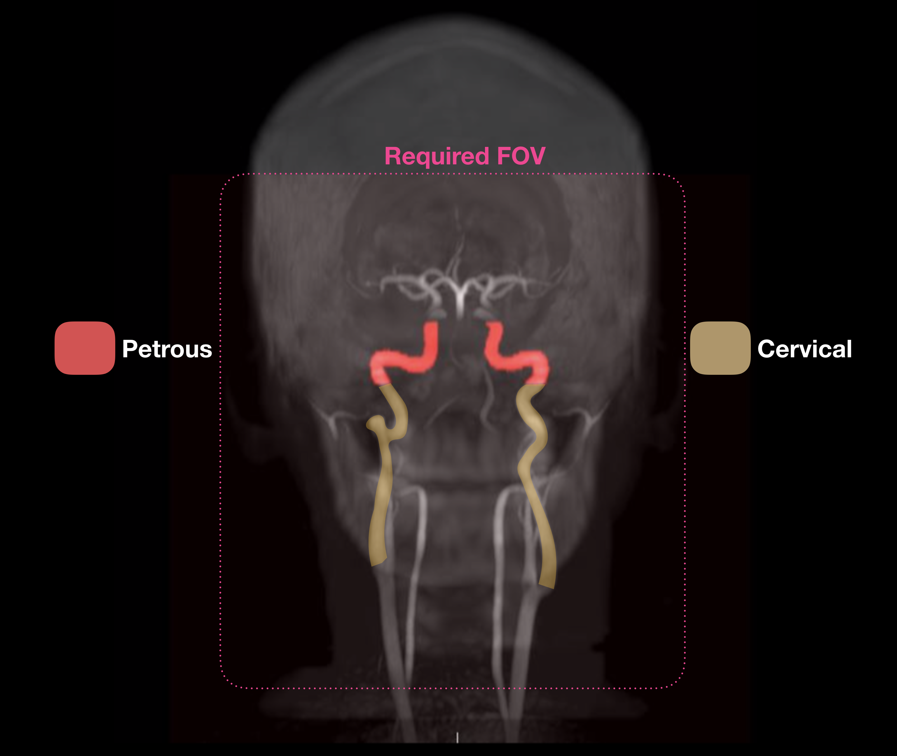
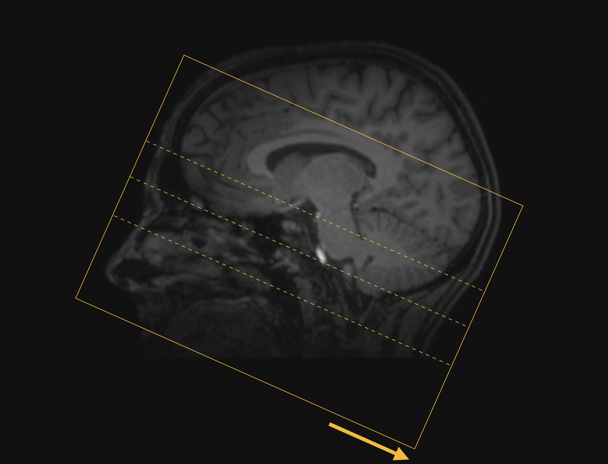
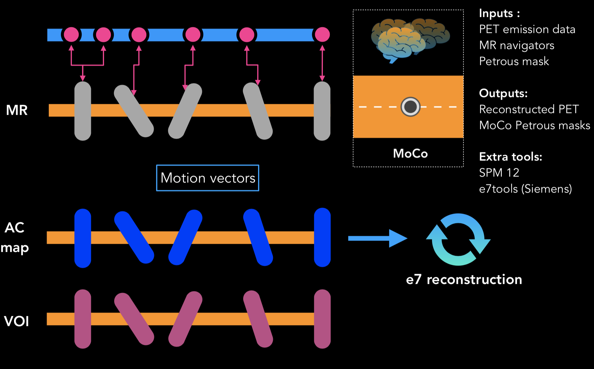
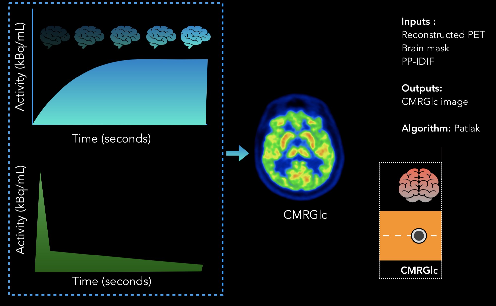
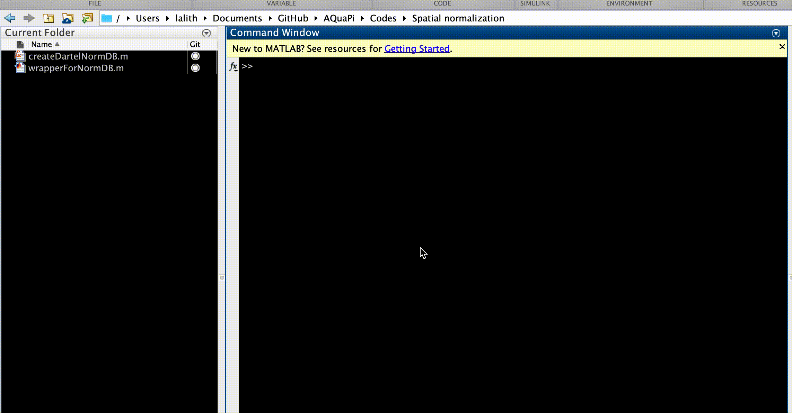

# AQuaPi Toolbox

AQuaPi: Absolute Quantification Pipeline, is a MATLAB based computational toolbox, for non-invasively measuring cerebral metabolic rates of glucose using the synergistic data from a fully-integrated PET/MR.The framework comprises of an image-derived input function component and a quantification component, that work together to produce cerebral metabolic rates of glucose maps.

Table of Contents
=================

  * [Abilities](#Abilities)
  * [Requirements](#Requirements)
     * [Ideal PET/MR protocol](#Ideal-PETMR-protocol)
  * [Literature](#Literature)
  * [Installation](#Installation)
  * [Usage](#Usage)
    * [Automated petrous/cervical segmentation](#Automated-petrouscervical-segmentation)
    * [Converting low-dose CT to CT-AC map](#converting-low-dose-ct-to-ct-ac-map)
    * [MR-driven motion compensation](#MR-driven-motion-compensation)
    * [Iterative regional partial volume correction](#terative-regional-partial-volume-correction)
    * [Voxel-wise Patlak analysis](#Voxel-wise-Patlak-analysis)
    * [Spatial normalisation](#Spatial-normalisation)
    * [Z-Score calculation](#Z-Score-calculation)
  * [Contributing](#Contributing)
  * [Funding](#Funding) 
  * [Credits](#Credits)
  * [License](#License)
  

# Abilities

- Petrous/cervical segmentation from a 3D time-of-flight MR angiography dataset
- Conversion of a low-dose CT image to CT-AC using carney bilinear scaling
- MR driven motion compensation (motion navigators needed): alignment of attenuation maps possible.
- Iterative regional partial volume correction aware of the activity variations of the target and background.
- Voxelwise Patlak analysis
- Spatial normalisation (SPM12 DARTEL)
- Z-score calculation

# Requirements

- Software requirements
  - MATLAB version > or = R2016a 
  - Medical Image Reader and Viewer : https://www.mathworks.com/matlabcentral/fileexchange/53745-medical-image-reader-and-viewer
  - SPM 12 
  - Siemens e7 reconstruction tools + JS-recon
  - Powershell ISE > 4.0
- Input data: Refer to the individual pages for detailed requirements.
  - 3D time-of-flight MR angiography
  - 60-min PET list-mode acquisition
  - 3D MPRAGE T1 MR sequence
  - 3D EPI MR navigators
  - Attenuation map: preferrably CT or pseudo-CT

## Ideal PET/MR protocol 

# Literature

- Shiyam Sundar LK, Muzik O, Beyer T. (2018). Towards quantitative [18F]FDG-PET/MRI of the brain: Automated MR-driven calculation of an image-derived input function for the non-invasive determination of cerebral glucose metabolic rates. Journal of Cerebral Blood Flow & Metabolism. https://doi.org/10.1177/0271678X18776820
- Shiyam Sundar LK, Muzik O, Beyer T. (2019). The promise of fully-integrated PET/MR imaging: Non-invasive clinical quantification of cerebral glucose metabolism. The Journal of Nuclear Medicine. https://doi.org/10.2967/jnumed.119.229567

# Installation

- Download all the AQuaPi folder from GitHub.
- Copy the contents to the MATLAB folder present in your system.
- Open the MATLAB console and go to the directory containing the 'MATLAB' folder.
- In the "Current Folder" of your MATLAB console, the directory containing the 'MATLAB' folder should be visible. 
- Right-click the 'MATLAB' folder from your MATLAB console, and choose 'Add to Path->select folders and subfolders'
- Now you can summon all the functions from AQuaPi.

# Usage

  ### Automated petrous/cervical segmentation
  #### Overview
  The segmentation algorithm has the ability to segment both the petrous and cervical region of the internal carotid arteries from the 3D time-of-flight MR angiography images in one go. 
  
  
    
  #### Hard-requirements
  - The field-of-view should include both petrous and cervical portion of the internal carotid arteries (refer the field-of-view shown below). 
  - Patient position should be head first supine (HFS orientation)
  #### Recommended field-of-view
  
  #### Tips
  1. Acquisition plane must be perpendicular to the blood flow in the internal carotid arteries. This ensures maximum contrast between the blood vessels and the surrounding tissues.
  2. The imaging field-of-view should be larger than the imaging object. This would prevent wrap-around artifacts like the nose protruding through the back of the head.
  
  
  #### The code breaks
  1. When there is a significant Signal drop in the blood vessels.
  2. When there are severe wrap-around artifacts.
  #### Running the codes : wrapperForSegmentation.m 
  
  ### Converting low-dose CT to CT-AC map
  #### Overview
  This function enables the conversion of low dose CT images to PET/MR compatible CT attenuation maps You can also use this program to strip off the pixel data from the dicom header if you use the last section :)
  #### Hard-requirements
  - Should be Siemens low-dose CT, however, this can be tweaked with a bit of effort.
  - Patient position should be head first supine (HFS orientation)
  - Dixon series is a hard-requirement.
  #### The code breaks
  Till now - never, fingers crossed!
  #### Running the codes : wrapperGenerateCTAC.m
  
  ### MR-driven motion compensation
  #### Overview
  MR-navigator based motion correction, which, apart from PET data alignment, also aligns the attenuation maps (dynamic AC maps) with PET emission data.
    
    
  #### [1] Alignment of AC maps with PET emission data
  This wrapper will rotate the attenuation maps based on the transformation matrices obtained from the MR Navigators. The sinogram headers from the JSRecon file is hacked to accomodate the different attenuation maps at different time points using powershell: MoCoRecon.ps1.
  #### Running the codes: wrapperForDynamicUmapRecon.m
  
  
  #### [2] Alignment of MR masks with the Reconstructed PET
  The MR masks are aligned with the Reconstructed PET from above using the motion vectors from the MR navigators. Only the MR masks are rotated in this step, PET remains intact to prevent further Partial volume effects.
  #### Running the codes: wrapperMoCo.m
  
  ### Iterative regional partial volume correction
  #### Overview
  An improved partial volume correction (PVC) method that is sensitive to the spatial and temporal variations of the target and background activities is implemented. 
  #### Running the codes: wrapperPVC.m
  
  ### Voxel-wise Patlak analysis
  #### Overview
  Motion vectors (MV’s) derived from the MR navigators were applied to the corresponding PET frames, resulting in motion-corrected PET frames (MoCo-PET). Following the spatial alignment, a voxel-wise Patlak graphical analysis (lumped constant, LC = 0.65) will be performed with it's respective input function.
 
  #### Running the codes: wrapperPatlak.m
  
  ### Spatial normalisation
  #### Overview
  For each subject, T1-w MR images were co-registered to their respective PET images. Individual T1-w MR image volumes were subsequently spatially normalized using the DARTEL (Diffeomorphic Anatomical Registration Through Exponentiated Lie algebra) software implemented in SPM 12. The resulting deformation fields were then applied to the co-registered CMRGlc images, thus, yielding a set of CMRGlc images that were transformed into template space. Once in template space, the set of CMRGlc images (n=20) defined a mean (μ) and SD (σ) map that constituted the NDB.
  #### Running the codes: wrapperForNormDB.m
  
  ### Z-score calculation
  #### Overview
  The resulting CMRGlc maps are spatially normalized are used to create an abnormality map (z-map) for individual patients.
  #### Running the codes: wrapperAbnormalityMap.m
  

# Contributing
Contributions are welcome from January 1, 2020. The current version is highly unstable. Further testing is required.

# Funding

This work was supported by the Austrian Science Fund KLI482-B31. We would like to thank Nvidia Corporation for graciously supporting us with the Nvidia Titan Xp GPU for accelerating our workflow.

# Credits

People responsible for awesome images:

- Benedikt Schmiedinger Dipl. Radiologietechnologe
- Julia Kesselbacher BSC Radiologietechnolgin

# License

MIT License

Copyright (c) 2019 Lalith Kumar Shiyam Sundar, Quantitative Imaging and Medical Physics, Medical University of Vienna

Permission is hereby granted, free of charge, to any person obtaining a copy
of this software and associated documentation files (the "Software"), to deal
in the Software without restriction, including without limitation the rights
to use, copy, modify, merge, publish, distribute, sublicense, and/or sell
copies of the Software, and to permit persons to whom the Software is
furnished to do so, subject to the following conditions:

The above copyright notice and this permission notice shall be included in all
copies or substantial portions of the Software.

THE SOFTWARE IS PROVIDED "AS IS", WITHOUT WARRANTY OF ANY KIND, EXPRESS OR
IMPLIED, INCLUDING BUT NOT LIMITED TO THE WARRANTIES OF MERCHANTABILITY,
FITNESS FOR A PARTICULAR PURPOSE AND NONINFRINGEMENT. IN NO EVENT SHALL THE
AUTHORS OR COPYRIGHT HOLDERS BE LIABLE FOR ANY CLAIM, DAMAGES OR OTHER
LIABILITY, WHETHER IN AN ACTION OF CONTRACT, TORT OR OTHERWISE, ARISING FROM,
OUT OF OR IN CONNECTION WITH THE SOFTWARE OR THE USE OR OTHER DEALINGS IN THE
SOFTWARE.

